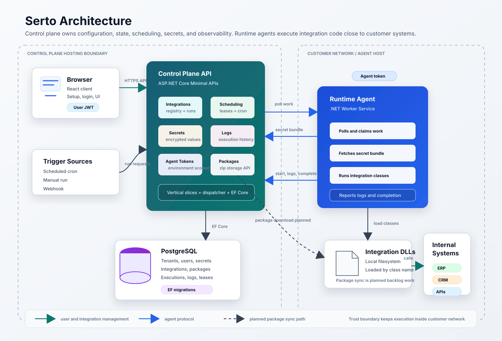

# Architecture: Integration-as-Code

## Overview

Integration Platform is a **Developer Integration Platform** designed for high-scale enterprise deployments. We treat integrations as **Infrastructure**, utilizing a **Code-as-the-Manifest** model that eliminates manual UI configuration.



### Key Architectural Layers

1.  **SDK (`IntegrationPlatform.Sdk`):** The code-first manifest definition. Developers use attributes to define triggers, schedules, and operational constraints directly on their classes.
2.  **Marketplace & Connectors (`IntegrationPlatform.Connectors`):** An extensible ecosystem of specialized connectors (e.g., SAP, Salesforce, SQL) that abstract enterprise complexity into idiomatic C#.
3.  **Governance Layer:** Built-in **Audit Logs**, **RBAC**, and **SSO** that meet enterprise procurement and compliance requirements.
4.  **Control Plane:** The multi-tenant orchestration engine. Performs **Assembly Scanning** to auto-provision integrations from uploaded packages.
5.  **Runtime Agent:** A stateless worker service that provides a secure "Execution Sandbox" close to the data.

The system is split into two independently deployable components:

```
┌─────────────────────────────────┐       ┌─────────────────────────────┐
│         Control Plane           │       │        Runtime Agent         │
│                                 │       │                              │
│  - Multi-tenant management      │◄─────►│  - Executes integrations     │
│  - Integration registry         │  API  │  - Fetches secret bundles    │
│  - Secrets management           │       │  - Reports execution results │
│  - Agent token issuance         │       │  - Runs on-premise           │
│  - Scheduling decisions         │       │                              │
└─────────────────────────────────┘       └─────────────────────────────┘
         ▲
         │  Browser
         ▼
┌─────────────────────────────────┐
│          React Frontend         │
│  (served as static files from   │
│   the control plane in prod)    │
└─────────────────────────────────┘
```

This separation is a first-class design decision. The control plane owns all state and decisions. Trigger adapters create work items in the control plane. The runtime agent is stateless: it claims work items, executes work, and reports back. This enables a self-hosted model where the agent runs inside the customer's network with access to internal systems, while the control plane can be cloud-hosted.

---

## Control Plane

### Stack

| Layer | Technology |
|-------|-----------|
| Runtime | .NET 10 / ASP.NET Core |
| API style | Minimal APIs |
| Architecture | Vertical Slice Architecture (VSA) |
| ORM | EF Core 10 + Npgsql |
| Database | PostgreSQL |
| Auth | JWT Bearer (user) + agent tokens (runtime) |
| Encryption | AES-256-CBC, random IV per value, PBKDF2 key derivation |
| Password hashing | BCrypt |
| JSON serialization | System.Text.Json with `JsonStringEnumConverter` (enums as strings) |

### Vertical Slice Architecture

Each feature lives in its own folder under `src/ControlPlane/Features/`. A slice contains everything needed for that feature:

```
Features/
  Integrations/
    CreateIntegration.cs      # Command + Handler + Repository interface + Result
    GetIntegration.cs
    ListIntegrations.cs
    UpdateIntegration.cs
    DeleteIntegration.cs
    IntegrationRepository.cs  # EF Core implementation
    IntegrationEndpoints.cs   # Minimal API route registration
```

**Rules:**
- Handlers never access infrastructure directly — always through interfaces registered with DI
- No cross-feature dependencies — features communicate via the dispatcher if needed
- No MediatR — a simple custom dispatcher resolves handlers by type from the DI container

### Command Dispatcher

```csharp
public class Dispatcher(IServiceProvider services) : IDispatcher
{
    public Task<TResult> SendAsync<TResult>(ICommand<TResult> command, CancellationToken ct = default)
    {
        var handlerType = typeof(ICommandHandler<,>).MakeGenericType(command.GetType(), typeof(TResult));
        dynamic handler = services.GetRequiredService(handlerType);
        return handler.HandleAsync((dynamic)command, ct);
    }
}
```

### Authentication

Three auth mechanisms exist:

1. **User JWT** — issued on login/setup, contains `sub`, `email`, `tenant_id`, `role` claims. Used for all web-based API calls.

2. **Personal Access Tokens (PATs)** — format `pat_<base64url(32 random bytes)>`. Used by the `ip` CLI. SHA-256 hash stored in the database. Authenticated via `UserTokenAuthenticationMiddleware` which injects standard user claims.

3. **Agent tokens** — format `agt_<base64url(32 random bytes)>`. SHA-256 hash stored in the database. Presented via `X-Agent-Token` header. Scoped to a single tenant + environment.

### Secrets

- Values are encrypted with AES-256 before storage
- A random 16-byte IV is generated per value and prepended to the ciphertext
- The encryption key is derived from a master key in config using PBKDF2 (100,000 iterations, SHA-256)
- Secret values are **never returned** through the user-facing API — only keys and metadata
- The secret bundle endpoint (`GET /api/agent/secrets/{environment}`) decrypts and returns all values for an environment, but is only accessible with a valid agent token

### SaaS Infrastructure

The control plane is built for multi-tenancy from the ground up:
- **Tenant Registration:** Public endpoints for self-service onboarding.
- **Invitations:** Secure, token-based team member invitation flow.
- **Quota Management:** `IQuotaService` enforces monthly execution limits per tenant, enabling tiered pricing models.
- **Billing Integration:** Built-in hooks for Stripe Customer and Subscription management.

### Enterprise Governance

The control plane provides the operational "safety net" required for high-value enterprise deployments:
- **Audit Logs:** Every secret change, deployment, and configuration update is immutably recorded.
- **RBAC:** Granular Role-Based Access Control to separate "Developers" from "Operations."
- **SSO/SAML:** (Phase 4) Integration with enterprise identity providers.
- **Compliance Reporting:** Exportable history for security and financial audits.

### Database

PostgreSQL via EF Core. Migrations are applied automatically on startup — no manual migration step is needed.

Schema:

```
tenants           — id, name, slug, status, max_executions_per_month, stripe_customer_id, stripe_subscription_id
users             — id, tenant_id, email, password_hash, role
user_tokens       — id, tenant_id, user_id, name, token_hash, last_used_at, expires_at
invitations       — id, tenant_id, email, token, role, expires_at, accepted_at
secrets           — id, tenant_id, environment, key, encrypted_value
integrations      — id, tenant_id, name, slug, description, environment, status, class_name, timeout_seconds, retry_max_attempts, retry_backoff_seconds, package_id
integration_triggers — id, tenant_id, integration_id, type, name, slug, enabled, cron_expression, encrypted_webhook_secret
agent_tokens      — id, tenant_id, name, environment, token_hash
agent_heartbeats  — id, tenant_id, agent_token_id, environment, version, hostname, current_concurrency, max_concurrency, last_seen_at
execution_records — id, tenant_id, integration_id, work_item_id, environment, status, attempt_number, parent_execution_id, root_execution_id, package_id, package_name, package_version, started_at, completed_at, error_message
execution_logs    — id, tenant_id, execution_record_id, timestamp, level, message, exception, properties_json
assembly_packages — id, tenant_id, name, version, file_name, data, size_bytes, sha256_hash
integration_schedule_states — id, tenant_id, integration_id, integration_trigger_id, last_dispatched_at, next_run_at
work_items        — id, tenant_id, integration_id, integration_trigger_id, environment, trigger_source, status, available_at, claim_owner, claim_expires_at, manual_run_request_id, payload, delivery_id, attempt_number, parent_execution_id, root_execution_id
webhook_deliveries — id, tenant_id, integration_id, integration_trigger_id, delivery_id, outcome, work_item_id, received_at
```

---

## Runtime Agent

The agent is a .NET Worker Service deployed by the customer. It:

1. Authenticates with the control plane using an agent token
2. Polls for work items in its tenant/environment
3. Fetches the secret bundle for its environment
4. Loads and executes the integration C# class with secrets injected
5. Reports execution status and any errors back to the control plane
6. Sends heartbeat telemetry with host, version, and concurrency data

### Configuration

The agent is configured via `appsettings.json` or environment variables:

| Setting | Description |
|---------|-------------|
| `ControlPlaneUrl` | Base URL of the control plane API |
| `AgentToken` | Token in format `agt_xxx` from the control plane UI |
| `Environment` | Environment this agent serves (e.g. `production`) |
| `IntegrationsPath` | Directory containing integration `.dll` files |
| `PollIntervalSeconds` | How often to check for due integrations (default: 30) |
| `MaxConcurrentExecutions` | Maximum parallel integration runs (default: 5) |

### Integration execution model

An integration is a C# class that implements a simple interface:

```csharp
public interface IIntegration
{
    Task RunAsync(IIntegrationContext context, CancellationToken ct);
}
```

`IIntegrationContext` provides:
- `Secrets` — the decrypted key/value map for the environment
- `Logger` — structured logging that feeds back to the control plane
- `Http` — a pre-configured `HttpClient`
- `Execution` — metadata about the current run (IDs, timestamps)

The agent discovers integration classes by scanning a directory for `.dll` files and finding all types that implement `IIntegration`. The control plane stores the fully-qualified class name (e.g. `MyCompany.Integrations.SyncOrdersIntegration`) which the agent uses for exact type lookup.

### SDK, connectors, and integrations

The SDK is the runtime contract: it defines how integration code plugs into the platform. Connectors are optional reusable libraries for common external-system work such as HTTP/API calls, SQL, SFTP/files, object storage, and notifications. Integrations are customer-specific business logic that composes the SDK and connectors.

This boundary keeps `IntegrationPlatform.Sdk` small and stable while still making common integration chores consistent, observable, retry-aware, and easy to test. See [SDK, Connectors, Trigger Adapters, And Integrations](sdk-connectors-and-adapters.md).

### Assembly packages

The control plane has an integration package API for tenant-scoped zip archives:

- `POST /api/integration-packages` stores a zip file containing compiled integration DLLs
- `GET /api/integration-packages` lists package metadata
- `GET /api/integration-packages/{id}/download` downloads the stored archive
- `DELETE /api/integration-packages/{id}` removes the stored archive
- `GET /api/agent/packages` lets runtime agents list tenant packages with an agent token
- `GET /api/agent/packages/{id}/download` lets runtime agents download tenant packages with an agent token

Packages are validated as zip files, must contain at least one `.dll`, and are stored with size and SHA-256 metadata. Package names and versions are unique per tenant.

Runtime agents sync packages into `PackagesPath`, verify SHA-256 before activation, and load extracted assemblies. Agents still also load DLLs from local `IntegrationsPath` for development.

Package-backed integrations can be pinned to a package version. Execution records snapshot the package id, package name, and package version used so history remains accurate after rollback or repointing. Current limitations: package deletion does not remove local agent cache entries, and assemblies are still loaded in the default load context.

### Trigger adapters

The trigger model is intentionally producer-based:

```
Trigger adapter -> WorkItem -> Agent claim -> ExecutionRecord -> Integration code
```

Scheduled, manual, and webhook triggers are the first built-in adapters:

- **Scheduled** evaluates cron state and creates scheduled work items when due.
- **Manual** turns a user "run now" request into a pending work item.
- **Webhook** validates an inbound signed request, stores the payload, records delivery state, and creates a pending work item.

Future trigger types should follow the same contract. Queue messages, file arrivals, database changes, workflow dependencies, dataset availability, and API events should all normalize their event metadata into a work item instead of introducing trigger-specific execution APIs. This keeps the runtime agent simple and makes observability, retries, claim recovery, and execution history consistent across trigger sources.

The implementation separates executable integration code from trigger configuration:

```
Integration -> one or more IntegrationTrigger records -> WorkItem -> ExecutionRecord
```

Under this model, one integration can be triggered by multiple schedules, one or more webhooks, manual operator action, queue events, file arrivals, API events, or future adapters. Runtime agents do not need a new execution path for any of these sources; trigger adapters produce work items and the agent executes the referenced integration class.

### Concurrency and scheduling

The agent implements several safety mechanisms:

- **Concurrency limit** — A configurable `MaxConcurrentExecutions` setting (default: 5) limits how many integrations can run simultaneously using a semaphore
- **In-flight tracking** — Each integration is tracked while executing; if a poll cycle fires while an integration is still running, it will be skipped to prevent overlapping executions
- **Durable cron scheduling** — The control plane evaluates cron schedules and persists `LastDispatchedAt` and `NextRunAt` in `integration_schedule_states`
- **Work-item dispatch** — Trigger adapters create work items. Agents claim work items with a claim owner and expiry (5 minutes), preventing duplicate dispatch while allowing abandoned claims to be reclaimed.

The poll endpoint creates due scheduled work and claims available work items inside serializable transactions. This prevents agent restarts from resetting scheduling state and keeps scheduled, manual, webhook, and future trigger sources on the same dispatch path. The agent still keeps local in-flight tracking so it does not overlap the same integration inside one process.

### Retry policy

Retries are modeled as normal work items. When an execution fails and the completion request is retryable, the control plane checks the integration's `RetryMaxAttempts` and `RetryBackoffSeconds`. If attempts remain, it creates a `Retry` work item with a future `AvailableAt`, increments `AttemptNumber`, and records `ParentExecutionId` plus `RootExecutionId`.

The retry work item is claimed by `GET /api/agent/integrations` after its backoff has elapsed. This keeps retries on the same dispatch, lease, overlap guard, execution history, and observability path as scheduled, manual, and webhook triggers.

Agent shutdown cancellation reports completion as non-retryable so shutdown does not create retry loops.

### Agent heartbeats

Runtime agents post heartbeat telemetry with their token, environment, assembly version, hostname, current concurrency, and max concurrency. The control plane stores one heartbeat row per tenant and agent token and exposes a JWT-protected list endpoint for operators. Agents are considered stale when the latest heartbeat is older than two minutes.

Heartbeats currently provide observability only. They do not yet drive agent pool routing, capacity-aware claim assignment, or package compatibility enforcement.

### Claim recovery

Each claimed work item includes a claim expiry after 5 minutes. This prevents two scenarios:

1. **Agent crash after poll** — If an agent polls, claims a work item, then crashes before starting execution, another agent can reclaim the work after the claim expires.
2. **Duplicate dispatch** — While a claim is active, other agents polling for the same environment will skip the claimed work item.

When starting execution (`POST /api/agent/executions`), the control plane validates that the requesting agent holds an active claim for the work item. When execution completes, the work item is marked `Completed`, `Failed`, or `TimedOut`.

### Agent ↔ Control Plane protocol

```
Agent                              Control Plane
  │                                      │
  │── POST /api/agent/heartbeat ───────►│  (report host/version/capacity)
  │◄─ 204 No Content ───────────────────│
  │                                      │
  │── GET /api/agent/integrations ──────►│  (claim due scheduled integrations)
  │◄─ { integrations: [...] } ───────────│
  │                                      │
  │── GET /api/agent/secrets/{env} ─────►│  (fetch secret bundle)
  │◄─ { secrets: { KEY: "val" } } ───────│
  │                                      │
  │── POST /api/agent/executions ───────►│  (open execution record)
  │◄─ { executionId, startedAt } ────────│
  │                                      │
  │  [execute integration locally]       │
  │── POST /api/agent/executions/{id}/logs ─►│  (record execution logs)
  │◄─ 204 No Content ────────────────────│
  │                                      │
  │                                      │
  │── PUT /api/agent/executions/{id} ───►│  (close with result)
  │◄─ 204 No Content ────────────────────│
```

The control plane validates execution requests:
- Integration must exist and belong to the agent's tenant
- Integration must match the agent's environment
- Integration must be enabled

---

## Frontend

| Technology | Purpose |
|-----------|---------|
| React 19 | UI framework |
| Vite | Build tool + dev server |
| TypeScript | Type safety |
| React Router v7 | Client-side routing |
| TanStack Query | Server state, caching, mutations |
| shadcn/ui + Tailwind | Component library |

In production, the React app is built to `src/ControlPlane/wwwroot` and served as static files by the .NET server. In development, Vite's dev server runs on port 5173 with API calls proxied to the backend on port 5000.

### Route structure

```
/setup          — First-run setup (public, redirects away if already complete)
/login          — Authentication (public)
/integrations   — Integration registry (protected)
/secrets        — Secrets management (protected)
/agent-tokens   — Agent token management (protected)
```

`ProtectedRoute` checks setup status and auth state before rendering protected routes, redirecting to `/setup` or `/login` as appropriate.

---

## Multi-tenancy

Every resource (user, secret, integration, agent token) is scoped to a `TenantId`. The `ICurrentUser` service extracts the tenant from the JWT claims on every request. Handlers receive `TenantId` as an explicit parameter and all database queries filter by it — there is no global tenant context or ambient state.

The database has a single schema shared across tenants (not schema-per-tenant). Row-level isolation is enforced in application code.

---

## Deployment

### Self-hosted (current)

The entire stack runs on a single host via Docker Compose:

```
docker-compose.yml
  ├── postgres   — database
  └── app        — control plane + frontend
```

Secrets (JWT key, encryption key, DB password) are supplied via a `.env` file.

### Hybrid (future)

```
Customer network                    Cloud (or customer VPS)
┌──────────────────┐               ┌──────────────────────┐
│  Runtime Agent   │◄─────────────►│    Control Plane      │
│  (on-premise)    │  HTTPS        │    (cloud-hosted)     │
└──────────────────┘               └──────────────────────┘
```

The control plane can be hosted centrally (SaaS) while the runtime agent runs inside the customer's network. The agent only needs outbound HTTPS access to the control plane — no inbound firewall rules required.
